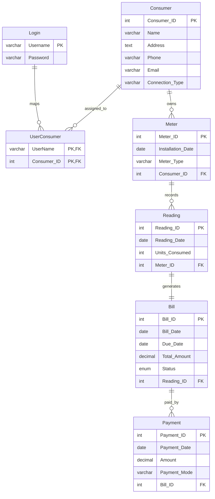

# Electricity Bill Generation System Report

## 1. Abstract

Every month, electricity billing affects both service providers and consumers, and even a small mistake can create delays and confusion. Electricity billing is an important part of utility management, and when records are handled manually, errors become more likely. The Electricity Bill Generation System was developed to solve this problem by changing the billing process into a simple web-based system.

This project is a full-stack web application built using Node.js, Express.js, MySQL, EJS, HTML, CSS, and JavaScript. It allows users to register, log in, manage consumer details, generate electricity bills, and record bill payments. The system also supports role-based access control, so the administrator can view all records, while normal users can view only their own related data.

The application has a simple structure. The frontend provides the login page, dashboard, consumer management, payment handling, and history views. The backend handles requests, sessions, and business logic, while the database stores users, consumers, meters, readings, bills, payments, and user-consumer mapping. Overall, the system creates a centralized workflow that improves speed, accuracy, and record keeping.

## 2. Introduction

The Electricity Bill Generation System is designed to computerize the management of electricity consumers and billing records. In many small organizations and academic projects, billing information is often handled manually or stored in separate files. This can lead to duplicate entries, delays in bill preparation, difficulty in checking payment history, and poor record management. A manual process also makes it harder to keep track of meter readings, generated bills, and payment updates in a proper and organized manner.

As the number of consumers grows, manual handling becomes even more difficult. Searching for records takes more time, updating consumer details becomes less efficient, and the chances of errors increase. Because of these problems, there is a need for a system that can store all important billing information in one place and make the process faster, easier, and more reliable.

This project solves that problem by bringing consumer registration, meter assignment, bill generation, and payment management into one application. The system uses a relational database so that consumer, meter, reading, bill, and payment records remain connected. It also includes session-based authentication and separate roles for administrators and normal users. This helps the system control access properly and ensures that users can work with only the records they are allowed to view.

The project is developed as a web-based application because a web interface is easy to use and can be managed from a browser without complicated setup for the end user. The dashboard-based design makes it easier to move between different tasks such as adding consumers, generating bills, making payments, and checking payment history. In this way, the system improves both usability and record management.

In this project, `server.js` works as the main application server, `schema.sql` defines the database structure, `views/dashboard.ejs` renders the dashboard, and the files inside `public` manage the client-side part of the application. The result is a working electricity billing solution that clearly shows the complete billing flow and demonstrates how a traditional process can be improved through a digital system.

### 2.1 Scope

The scope of this project is to develop a local web-based electricity billing management system for academic and demonstration purposes. The system covers the main billing activities such as user registration, login, session handling, role-based access control, consumer record creation, automatic meter assignment, bill generation, payment processing, and payment history tracking. It also supports consumer-wise bill viewing through meter identification and gives the administrator better control over records, including deletion when needed. However, the current version is limited to core billing functions and does not include features such as online payment gateways, OTP verification, tariff slabs, report export, or real-time meter integration. Even with these limits, the project clearly shows how a manual billing process can be converted into a digital system.

### 2.2 Requirement Analysis

Requirement analysis explains what the system should do and what it needs in order to work properly. In this project, the system must support account creation, user login, and session maintenance so that authenticated users can access the application securely. It must separate administrator and normal user roles, because the administrator can view all consumers and payment records, while normal users can view only their own mapped consumer data. The system must allow users to add consumer details, automatically create a connected meter record, generate bills using the entered meter ID and consumed units, and calculate the bill amount according to the logic used in the application. It must also assign a due date, accept bill payments, prevent duplicate payment of already paid bills, and reject payments that are less than the full amount.

The project also has some important non-functional requirements. The system should be easy to use, simple to navigate, and fast enough for tasks such as login, consumer addition, bill generation, and payment history retrieval. It should also be maintainable, which is supported by the separation of backend logic, database schema, views, and frontend files. Reliability is important because the system depends on proper relationships between tables such as consumer, meter, reading, bill, and payment. Although this version is mainly for academic use, it should still support future improvement. From a security point of view, the system includes login and session handling, but stronger controls such as password hashing and better validation would be needed in a real-world application.

### 2.3 Software and Hardware Details

The development of this project requires both software and hardware components. On the software side, the frontend is built using HTML, CSS, JavaScript, and EJS to create an interactive user interface. The backend is developed using Node.js and Express.js, which handle server-side logic, routing, and communication with the database. MySQL is used as the database management system to store and manage all electricity billing data. Tools such as Visual Studio Code and MySQL Workbench can be used for coding and database management. The application runs on standard web browsers such as Google Chrome or Microsoft Edge.

In terms of hardware, a basic computer system with a minimum of 4 GB RAM and a standard processor such as Intel i3 or above is sufficient to run the application smoothly. Adequate storage space is also required to store the project files, installed packages, and database.

### 2.4 Libraries / Packages Used

The project utilizes several libraries and packages to improve functionality and simplify development. Express.js is used as the main backend framework to handle routing, middleware, and server operations efficiently. The mysql2 package is used to connect the Node.js application with the MySQL database and perform database queries. Express-session is included to manage user sessions after login, which helps the system remember authenticated users and their roles. Body-parser is used to process incoming request data in both form and JSON format. EJS is used as the templating engine to render dynamic content on the dashboard page. In addition, nodemon is used during development to restart the server automatically whenever changes are made to the project files.

## 3. Database Design

A well-structured database is the backbone of this system because it ensures proper storage, retrieval, and management of data. In an electricity billing system, maintaining data accuracy and avoiding unnecessary repetition is very important. For that reason, careful planning of the database structure is essential for smooth and reliable system operation.

The database for this project is designed using a relational model so that data can be stored and accessed efficiently. It contains multiple tables that are connected to one another through relationships. Each table is created to store a specific type of information, such as user login details, consumer records, meter information, reading details, bill records, payment records, and the mapping between users and consumers.

This design helps in reducing redundancy, maintaining consistency, and improving overall data management. The use of primary keys and foreign keys creates proper links between different tables and helps maintain data integrity. In this project, the database plays a major role because it supports bill generation, payment tracking, consumer management, and record retrieval in an organized way.

### Table-wise Explanation

#### Login Table

The `Login` table stores user authentication details. It uses `Username` as the primary key and contains the fields `Username` and `Password`. In this project, passwords are stored as plain text, which is acceptable only for an academic prototype. In a real application, passwords should be securely hashed.

#### Consumer Table

The `Consumer` table stores the details of each electricity consumer, including name, address, phone number, email, and connection type. It uses `Consumer_ID` as the primary key.

#### Meter Table

The `Meter` table stores the meter details linked to a consumer. It uses `Meter_ID` as the primary key and `Consumer_ID` as a foreign key. In this application, a digital meter is created automatically when a consumer is added.

#### Reading Table

The `Reading` table stores meter readings. It uses `Reading_ID` as the primary key and `Meter_ID` as a foreign key. It keeps the reading date and the number of units consumed.

#### Bill Table

The `Bill` table stores bill information such as bill date, due date, total amount, and status. It uses `Bill_ID` as the primary key and `Reading_ID` as a foreign key. A bill is first marked as unpaid and later updated to paid after successful payment.

#### Payment Table

The `Payment` table stores the payment date, amount, payment mode, and related bill ID. It uses `Payment_ID` as the primary key and connects to the `Bill` table through a foreign key.

#### UserConsumer Table

The `UserConsumer` table links users and consumers. It uses a composite primary key made of `UserName` and `Consumer_ID`. This table is important because it helps control which consumer records belong to which user.

### Database Design Logic

The database is arranged in a clear way, with each table representing a separate part of the system. Login information is kept separate from consumer data, consumer data is separated from meter details, and transaction-related data such as readings, bills, and payments are stored in different tables. This reduces duplication and supports a natural data flow of `User -> Consumer -> Meter -> Reading -> Bill -> Payment`.

### 3.1 Data Modeling (E-R Diagram Explanation)

The Entity-Relationship (E-R) diagram represents the structure of the database and the relationships between different entities in the system. The main entities in this project include Login, Consumer, Meter, Reading, Bill, Payment, and UserConsumer. The Login entity stores user account details, while the Consumer entity contains the personal and connection-related details of each electricity consumer.

The Meter entity stores meter information linked to a consumer, and the Reading entity keeps the unit consumption details recorded for each meter. The Bill entity stores bill-related information such as bill date, due date, amount, and payment status. The Payment entity manages the payment records of generated bills, while the UserConsumer entity connects users with their related consumer records. These entities are interconnected to ensure proper data flow and accurate management of electricity billing information.

#### E-R Diagram

## 4. Graphical User Interface (Screenshots of UI)

The graphical user interface of the system is designed to be simple, clean, and user-friendly. It mainly consists of a login and registration interface and a dashboard interface for authenticated users. The login page provides access to the system, and once the user logs in successfully, the user is directed to the dashboard. The dashboard includes different sections for consumer management, payment management, and payment history. The interface also displays user role information, which helps in giving different access to administrators and normal users. Overall, the GUI is designed to make navigation easy and to help users manage billing records in a clear and organized way.

### 4.1 Login Page

The login page is the starting point of the application. It includes username and password fields, a login button, a create account button, and a registration modal popup. After successful login, the user is redirected to `/dashboard`.

Insert screenshot here:

`Figure 4.1: Login Page`

### 4.2 Registration Modal

The registration modal opens from the login page and allows a new user to create an account without leaving the same screen. It appears when the user clicks Create Account and closes when the user clicks the close icon or outside the modal.

Insert screenshot here:

`Figure 4.2: Registration Modal`

### 4.3 Dashboard

After login, the user is taken to the dashboard. The dashboard includes a sidebar with user and role details, navigation buttons, a consumer management panel, a payment management panel, and a payment history panel.

Insert screenshot here:

`Figure 4.3: Main Dashboard`

### 4.4 Consumer Management Panel

This panel is used to add consumers and view the consumer list. It includes the add-consumer form, the consumer table, and a meter bill summary table. For administrators, filter buttons and a delete option are also available.

Insert screenshot here:

`Figure 4.4: Consumer Management Panel`

### 4.5 Payment Management Panel

This panel is used for bill generation and payment. In the bill generation section, the user enters the meter ID and consumed units. In the payment section, the user enters the bill ID, amount, and payment mode. The system then verifies the details and updates the bill status after payment.

Insert screenshot here:

`Figure 4.5: Payment Management Panel`

### 4.6 Payment History Panel

This section shows payment records in table form. A normal user can see payment ID, date, amount, mode, and bill ID, while an administrator can also see the related consumer name and phone number.

Insert screenshot here:

`Figure 4.6: Payment History Panel`

## 5. Conclusion

The Electricity Bill Generation System shows how a traditional billing process can be changed into a web-based digital system. The application brings together authentication, consumer management, bill calculation, payment tracking, and role-based access control in one platform. From an academic point of view, the project is useful because it covers important software engineering concepts such as client-server architecture, relational database design, CRUD operations, session handling, and responsive interface design. The system meets its main goal of managing electricity billing records digitally and also provides a good base for future improvements such as better security, advanced billing logic, and additional reporting features.
